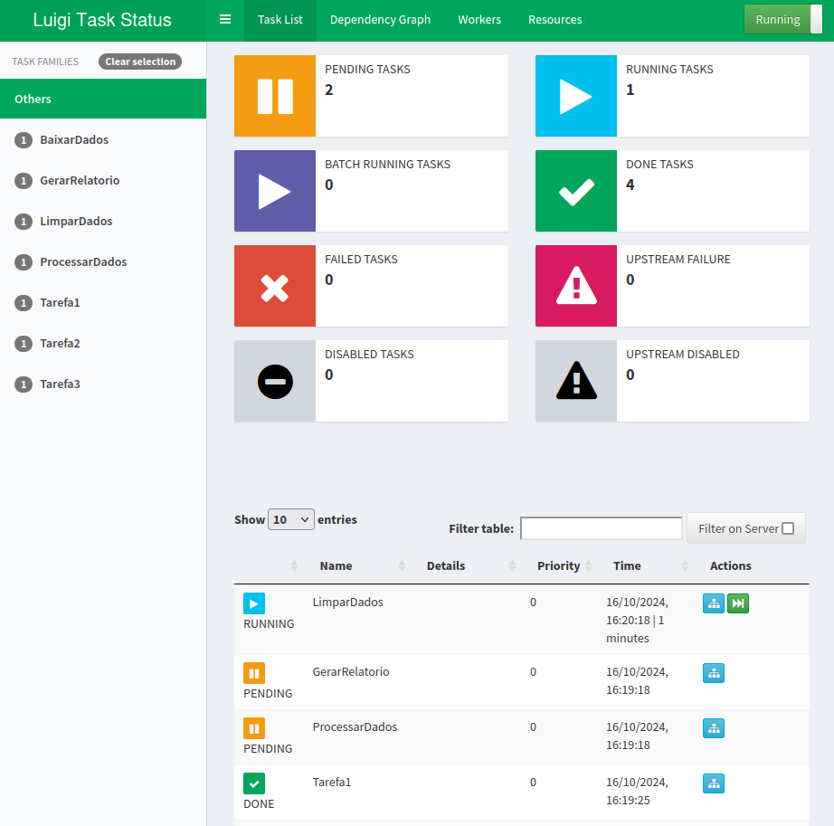

# Orquestração de tarefas (pipeline) com Luigi


### Apresentação
Neste projeto foram implementados três exemplos de orquestração de tarefas e suas dependências em python utilizando as tecnologias:

- [luigi](https://luigi.readthedocs.io/en/stable/index.html)
- [toml](https://github.com/toml-lang/toml)

O Luigi é um pacote python que auxilia a construção de pipelines complexos de trabaho em lotes. Ele lida com:

- resolução de dependência
- gerenciamento de fluxo de trabalho
- visualização
- gerenciamento de falhas
- CLI e outros


### Passo 1
Primeiramente, faça o download do projeto:
```
git clone https://github.com/andviana/luigi_toml_example.git
```

### Passo 2
Agora, entre na pasta do projeto e abra a sua IDE (os comandos abaixo abrirão o Visual Studio Code na pasta raiz do projeto)
```
cd luigi_toml_example
code .
```

### Passo 3 (opcional)
Se precisar criar um ambiente vitual, no terminal, execute os comandos:
> *a criação do venv é um passo necessário no **Ubuntu 24**, bem como em outras distros linux*
```
python3 -m venv .venv
source .venv/bin/activate
```
Para desativar o ambiente virtual (venv), use o comando abaixo:
> *não execute esse comando agora, pois caso seja o venv seja desativado, problemas podem ocorrer ao tentar instalar as dependencias do projeto com o* ```pip```
```
deactivate
```

### Passo 4
No terminal do seu IDE, exwcute a instalação do [luigi com toml](https://luigi.readthedocs.io/en/stable/index.html) conforme comando abaixo:
```
pip install luigi[toml]
```

### Passo 5
Execute o monitor web do luigi, e abra-o em seu navegador, informarndo o host e a porta 8082:
```
.venv/bin/luigid --port 8082
```
abra o navegador no endereço [http://localhost:8082](http://localhost:8082)

### Passo 6
O projeto possui 3(três) exemplos de pipelines: 

1. Pipeline simples com o encadaemento de 3 tarefas, sem uso de classe WrapperTask, utilizando a função ```luigi.run()```.
Para executar o exemplo, execute o comando:
```
.venv/bin/python3 pipeline_simple_build.py Pipeline --scheduler-host localhost
```

2. Pipeline simples com o encadaemento de 4 tarefas, usando a classe WrapperTask, utilizando a função ```luigi.buid()```.
Para executar o exemplo, execute o comando:
```
.venv/bin/python3 pipeline_simple_build.py Pipeline --scheduler-host localhost
```

3. Pipeline com 10 tarefas e dependências multiplas, utilizando principios de segregação de interface (ISP) e singleton para o carregamento de configurações.
Para executar o exemplo, execute o comando:
```
.venv/bin/python3 pipeline.py Pipeline
```


### Capturas de tela da Execução
1. Lista de Tarefas (tasklist)


2. Graficos da Execução


3. Workers


